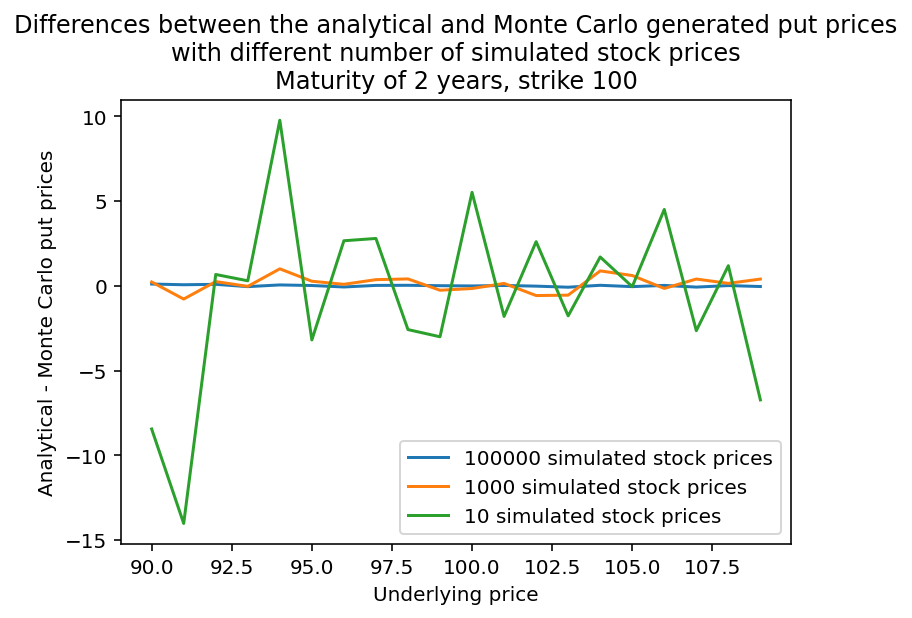
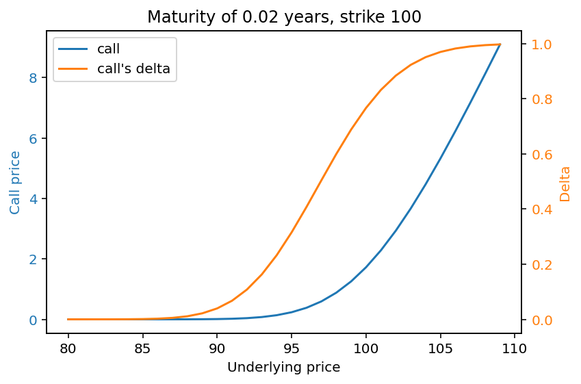
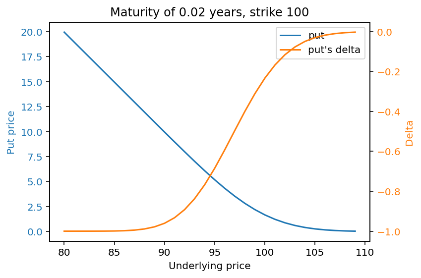
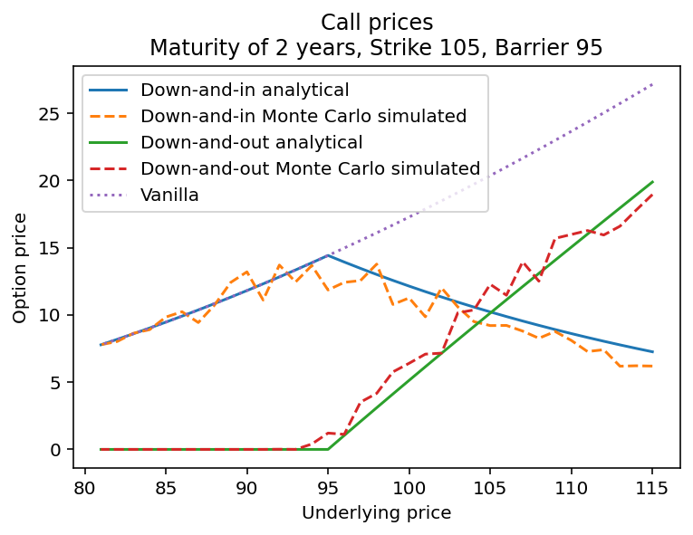
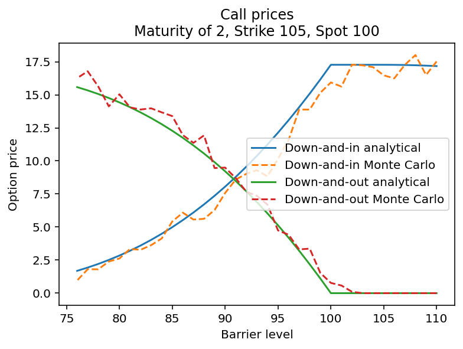
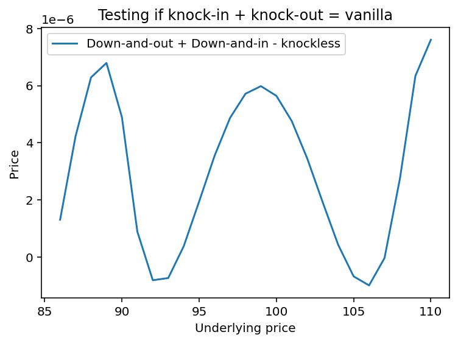
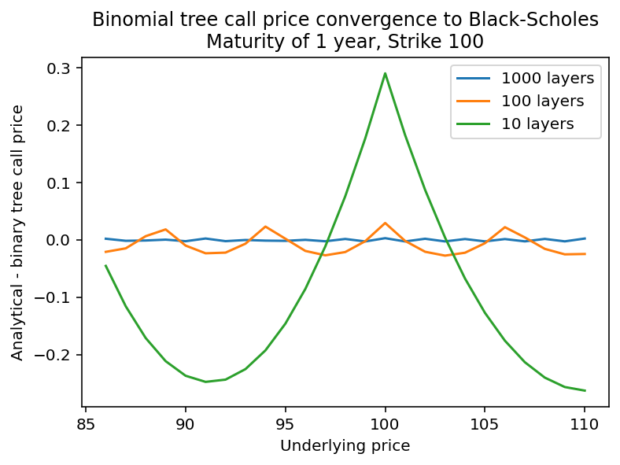
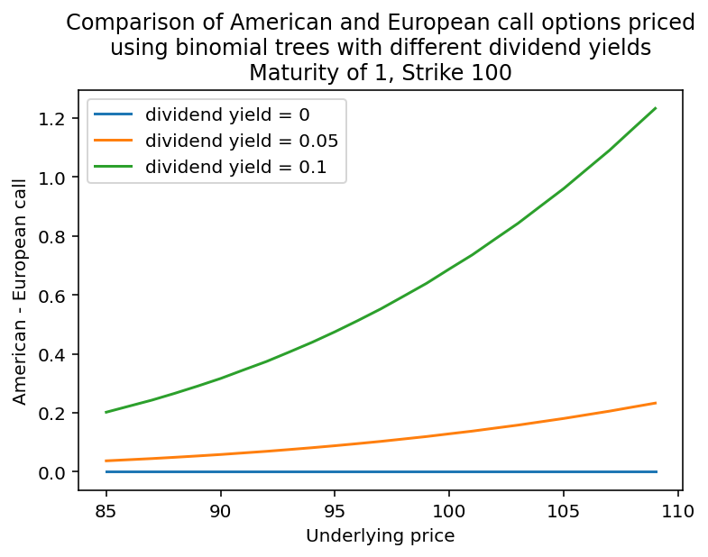
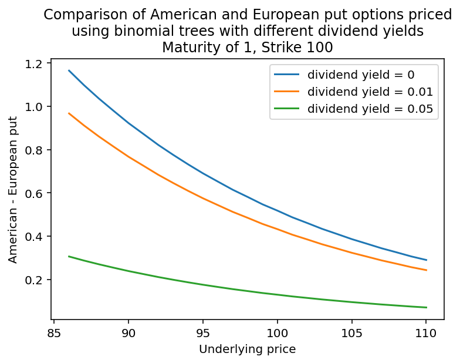
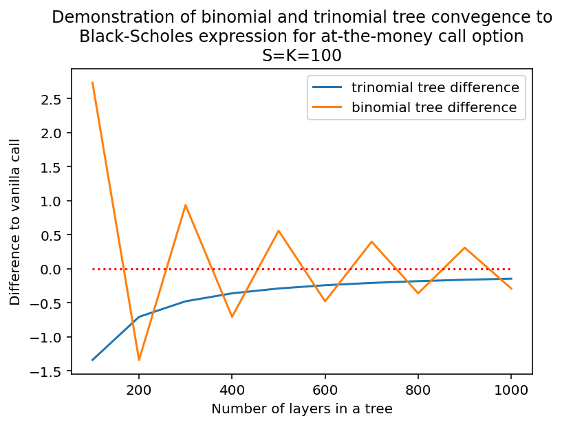

# Financial Derivative Pricing

Python implementations of financial derivative pricing models, including Black-Scholes analytical formulas, barrier options, binomial trees, and trinomial trees. This repository is an ongoing project — further pricing models and instruments will be added over time.

Formulas and methodology are primarily drawn from **Mark S. Joshi, *The Concepts and Practice of Mathematical Finance* (2nd ed.)**, with additional reference to standard results from Wikipedia where noted.

---

## Repository Structure

| File | Description |
|------|-------------|
| `black_scholes_option_pricing.py` | Core Black-Scholes pricing functions |
| `Black_Scholes_testing.py` | Tests and visualisations for Black-Scholes prices |
| `call_knock_in_and_out_european_option.py` | Analytical and Monte Carlo pricing of barrier options |
| `call_knock_out_and_in_test.py` | Tests and visualisations for barrier option prices |
| `binary_trees.py` | Binomial tree pricing for European and American options |
| `binary_tree_test.py` | Tests and visualisations for binomial tree prices |
| `tri_tree.py` | Trinomial tree pricing for European options |
| `tri_tree_test.py` | Tests and visualisations comparing trinomial and binomial convergence |

---

## Models Implemented

### Black-Scholes (`black_scholes_option_pricing.py`)
Analytical closed-form pricing for:
- European calls and puts
- Digital (binary) calls and puts
- Monte Carlo simulation of European calls and puts for validation

The cumulative normal distribution is approximated using the polynomial method from Joshi (Appendix B.2.2, pg. 437).

#### Put and Call Prices from Black-Scholes Equations
Black-Scholes model provides a way to price puts and calls in a world where you can continuously and freely trade. There are also other ways to price these options, with one of them being Monte Carlo simulation. In the simulation, computer draws normally distributed numbers with mean 0 and standard deviation of 1 to generate stock's price when the European option expires. The final price then determines the option's payoff, which in turn influences options values.




As you can see in these graphs, Monte Carlo can approximate Black-Scholes valuation fairly well with just around 1000 simulations and almost no noticeable difference with 100000 simulations.

#### Call-Put Parity
Call-Put parity describes the relationship between call, put, and forward contract prices, which states that Call - Put = Forward.


While the line does show a single line, that is because Call - Put line is hidden behind Forward price curve. This graph thus shows that Call, Put, and Forward price calculating functions adhere to this parity.

#### Covered Calls and Protective Puts
Another well known principle is that a portfolio of a stock and call (known as a covered call) replicates the payoff of a government's zero-coupon bond and stock's put (also known as protective put), i.e. Stock + Call = Bond + Put.


Similarly to the Call-Put graph above, protective put completely covers covered calls' payoff, thus showing that this principle is being upheld by the functions.


### The Greeks (greek.py)
Contains functions of analytically derived call and put greeks. These greeks are:
- Delta
- Gamma
- Vega

#### Showing Greeks
A very important part of option investing is to know how sensitive option's value is to the change of stock value. That is why the Greeks were defined. These greeks are delta (option's price derivative with respect to stock's price), gamma (delta derivative with respect to stock's price), and vega (the option's price derivative with respect to implied volatility). These derivatives are useful when trying to construct a theoretically perfectly hedged portfolio of various positions on a stock and related derivatives.







The graphs above visually represent how these greeks change as the stock's price changes.

### Barrier Options (`call_knock_in_and_out_european_option.py`)
Analytical and Monte Carlo pricing for:
- Down-and-in calls
- Down-and-out calls

Analytical formulas follow Joshi pg. 217-219 (Theorems 8.3 and 8.4). The knock-in + knock-out = vanilla parity is verified, with a noted limitation: this parity holds cleanly only when `H < K`, due to a modified `dHelp` expression used when `H >= K`.

Monte Carlo pricing uses a path-dependent stock price generator with 1,000 steps and 1,000 simulated paths per price point.

#### Demonstration of Barrier Option Prices



The graph shows the prices of the down-and-in, down-and-out, and vanilla call option prices with maturity of 2 years, strike at 105 and a barrier at 95. I have also included Monte Carlo simulated prices at current spot prices to show that these simulations are able to accurately approximate analytical values of the Black-Scholes world. The 'jagedness' is present because it would have taken so much longer to simulate smoother Monte Carlo results. Continuous barrier scenario required simulating small time-steps to accurately track when, and if, the option gets knocked out, whereas the vanilla options were only concerned with the final values. Thus, we would have needed many more simulations for a smoother graph.

#### Varying the Barrier



This graph shows how down-and-in and down-and-out prices change with barrier level increasing at a constant spot of 100 and a strike of 105. It is noticeable from the graph that the highest delta can be observed just before the barrier. In addition, because a barrier above the spot immediately knocks out down-and-out option, we can deduce that the vanilla option price is around 17.5 based on down-and-in value.

#### Testing the Knock-in + Knock-out = Vanilla Claim

It is stated by Mark S. Joshi in the book "The Concepts and Practice of Mathematical Finance" 2nd edition pg. 202 that knock-in + knock-out = Vanilla because no matter the barrier, at least one option will be exercised.



The graph above shows that the produced scripts follow this principle up to a certain degree. Notice that the scale on the y-axis is on the order of 10^(-6). The option valuation methods used to produce this graph used only analytical formulae, hence this undulation of difference cannot be explained by random number generation. While it is possible to write this difference off as just floating point error, it should be studied more thoroughly.

### Binomial Trees (`binary_trees.py`)
Cox-Ross-Rubinstein binomial tree pricing for:
- European calls and puts
- American calls and puts (via backward induction)



The above graph shows how well the binary tree is able to approximate Black-Scholes call price. We can see that the higher the number of layers, the better the approximation is.

The backward induction algorithm explicitly compares continuation value against immediate exercise value at each node.



The early exercise premium for American options is clearly visible when the dividend rate `d > 0`.



Interestingly, it can be seen that the larger the dividend rate is, the lower the American put option premium is.

> **Note:** An `OverflowError` may occur at high layer counts (tested at `layers = 1000`) due to large binomial coefficients in the European pricer. The American pricer uses backward induction and is not affected by this issue.

### Trinomial Trees (`tri_tree.py`)
Trinomial tree pricing for:
- European calls (via backward induction)

Up/down move probabilities follow the formulation described on the [Wikipedia Trinomial Tree article](https://en.wikipedia.org/wiki/Trinomial_tree). Convergence to the Black-Scholes price is demonstrated in `tri_tree_test.py`, where the trinomial model is shown to approximate Black-Scholes more closely than the binomial model at equivalent layer counts.



For a clear comparison, an at-the-money vanilla call option was chosen for calculations. The binary tree model sometimes over-shot before under-shooting the Black-Scholes price while converging to it. Meanwhile, trinomial tree monotonically approached the Black-Scholes price from below, with an increasing number of layers, while also having a smaller difference than the binomial tree at all number of layers considered. 

---

## Dependencies

```
numpy
scipy
matplotlib
math
```

Install via:
```bash
pip install numpy scipy matplotlib
```

---

## Usage

The test files are written for use in **Spyder** (or any IPython-compatible environment). The `#%%` cell delimiters allow individual sections to be run independently, making it easy to inspect intermediate results and plots without re-running the full script.


## References

- Joshi, M. S. (2008). *The Concepts and Practice of Mathematical Finance* (2nd ed.). Cambridge University Press.
- [Trinomial Tree — Wikipedia](https://en.wikipedia.org/wiki/Trinomial_tree)
