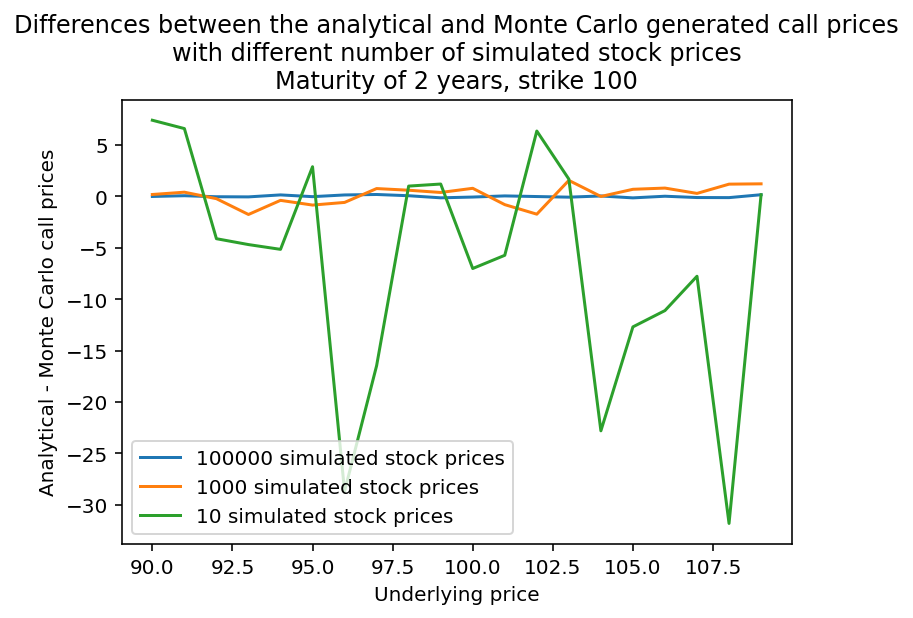
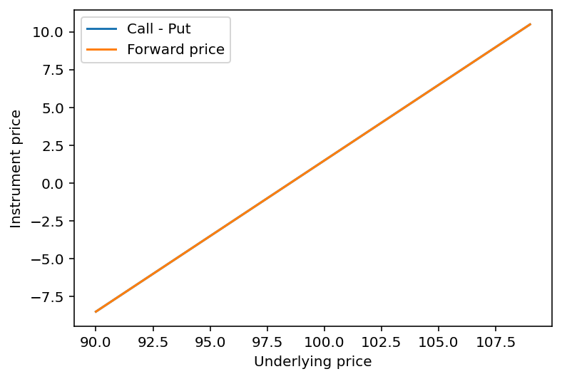
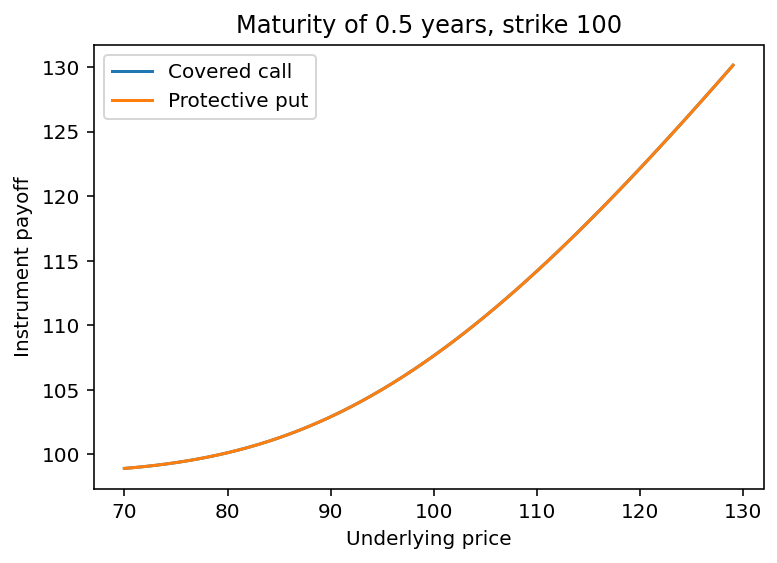
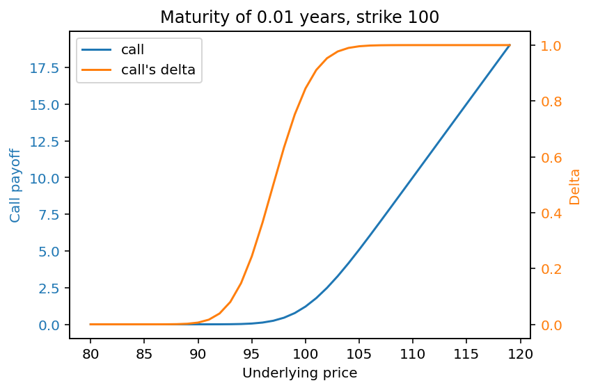
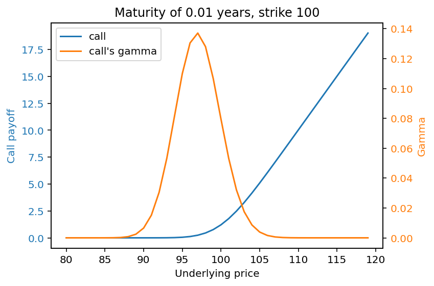
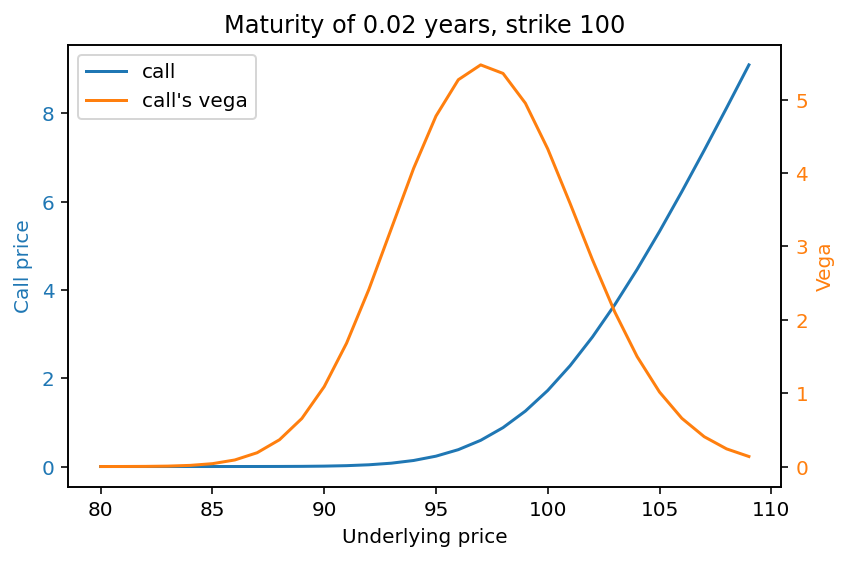
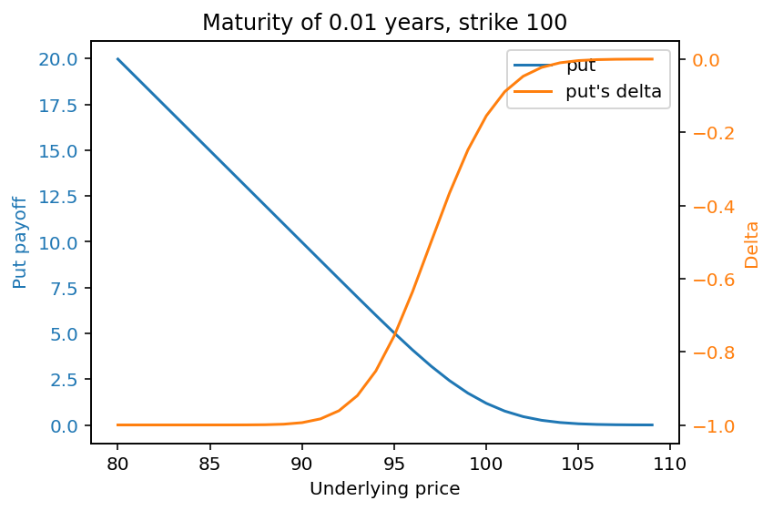
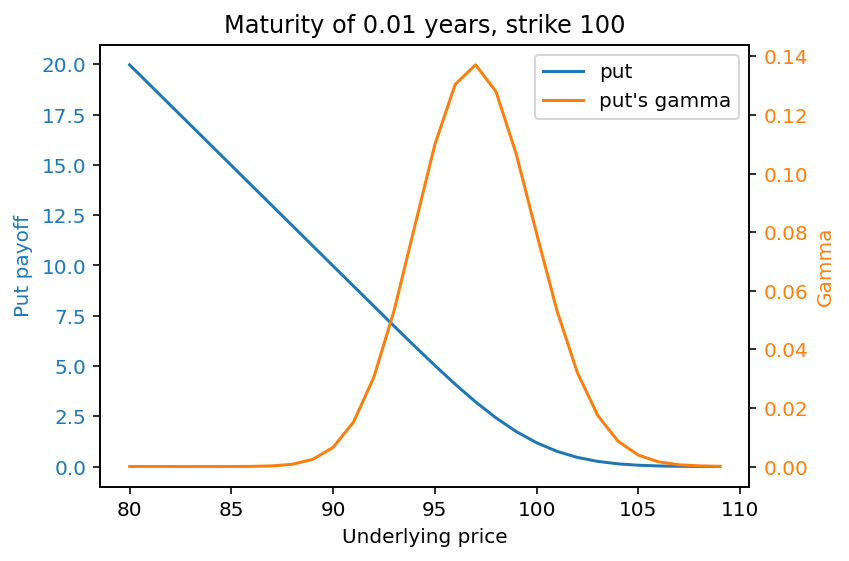
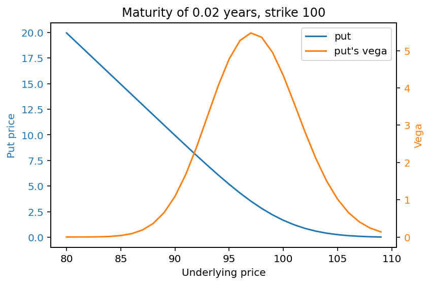

# Financial Derivative Pricing

Python implementations of financial derivative pricing models, including Black-Scholes analytical formulas, barrier options, binomial trees, and trinomial trees. This repository is an ongoing project — further pricing models and instruments will be added over time.

Formulas and methodology are primarily drawn from **Mark S. Joshi, *The Concepts and Practice of Mathematical Finance* (2nd ed.)**, with additional reference to standard results from Wikipedia where noted.

---

## Repository Structure

| File | Description |
|------|-------------|
| `black_scholes_option_pricing.py` | Core Black-Scholes pricing functions |
| `Black_Scholes_testing.py` | Tests and visualisations for Black-Scholes prices |
| `call_knock_in_and_out_european_option.py` | Analytical and Monte Carlo pricing of barrier options |
| `call_knock_out_and_in_test.py` | Tests and visualisations for barrier option prices |
| `binary_trees.py` | Binomial tree pricing for European and American options |
| `binary_tree_test.py` | Tests and visualisations for binomial tree prices |
| `tri_tree.py` | Trinomial tree pricing for European options |
| `tri_tree_test.py` | Tests and visualisations comparing trinomial and binomial convergence |

---

## Models Implemented

### Black-Scholes (`black_scholes_option_pricing.py`)
Analytical closed-form pricing for:
- European calls and puts
- Digital (binary) calls and puts
- Monte Carlo simulation of European calls and puts for validation

The cumulative normal distribution is approximated using the polynomial method from Joshi (Appendix B.2.2, pg. 437).

#### Put and Call Prices from Black-Scholes Equations
Black-Scholes model provides a way to price puts and calls in a world, where you can continuously and freely trade. There are also other ways to price these options, with one of them being Monte Carlo simulation. In the simulation, computer draws normally distributed numbers with mean 0 and standard deviation of 1 to generate stock's price when the European option expires. The final price then determines the option's payoff, which in turn influences options values.


As you can see in these graphs, Monte Carlo can approximate Black-Scholes valuation fairly well with just around 1000 simulation and almost no noticible difference with 100000 simulations.

#### Call-Put Parity
Call-Put parity describes the relationship between call, put, and forwad contract prices, which states that Call - Put = Forward.

While the line does show a single line, that is because Call - Put line is hidden behind Forward price curve. This graph thus shows that Call, Put, and Forward price calculating functions adhere to this parity.

#### Covered Calls and Protective Puts
Another well known principle is that a portfolio of a stock and call it's (covered call) replicates the payoff of a government's zero-coupon bond and stock's put. I.E. Stock + Call = Bond + Put.

Similarly to the Call-Put graph above, protective put completely covers covered calls' payoff, thus showing that this principle is being upheld by the functions.


### The Greeks (greek.py)
Contains functions of analytically derived call and put greeks. These greeks are:
- Delta
- Gamma
- Vega

#### Showing Greeks
A very important part of option investing is to know how sensitive option's value is to the change of stock value. That is why the Greeks were defined. These greeks are delta (options's price derivative with respect to stock's price), gamma (delta derivative with respect to stock's price), and vega (option's price derivative with respect to implied volatility). These derivatives are useful when trying to contruct a theoretically perfectly hedged protfolio of various positions on a stock and related derivatives.






Graph's above visually represent how these greeks change as the stock's price changes. Notice that Put's gamma and vega behave like Call's gamma and vega, but only mirrored around the strike. 

### Barrier Options (`call_knock_in_and_out_european_option.py`)
Analytical and Monte Carlo pricing for:
- Down-and-in calls
- Down-and-out calls

Analytical formulas follow Joshi pg. 217-219 (Theorems 8.3 and 8.4). The knock-in + knock-out = vanilla parity is verified, with a noted limitation: this parity holds cleanly only when `H < K`, due to a modified `dHelp` expression used when `H >= K`.

Monte Carlo pricing uses a path-dependent stock price generator with 1,000 steps and 1,000 simulated paths per price point.

### Binomial Trees (`binary_trees.py`)
Cox-Ross-Rubinstein binomial tree pricing for:
- European calls and puts
- American calls and puts (via backward induction)

The early exercise premium for American options is clearly visible when the dividend rate `d > 0`. The backward induction algorithm explicitly compares continuation value against immediate exercise value at each node.

> **Note:** An `OverflowError` may occur at high layer counts (tested at `layers = 1000`) due to large binomial coefficients in the European pricer. The American pricer uses backward induction and is not affected by this issue.

### Trinomial Trees (`tri_tree.py`)
Trinomial tree pricing for:
- European calls (via backward induction)

Up/down move probabilities follow the formulation described on the [Wikipedia Trinomial Tree article](https://en.wikipedia.org/wiki/Trinomial_tree). Convergence to the Black-Scholes price is demonstrated in `tri_tree_test.py`, where the trinomial model is shown to approximate Black-Scholes more closely than the binomial model at equivalent layer counts.

---

## Dependencies

```
numpy
scipy
matplotlib
math
```

Install via:
```bash
pip install numpy scipy matplotlib
```

---

## Usage

The test files are written for use in **Spyder** (or any IPython-compatible environment). The `#%%` cell delimiters allow individual sections to be run independently, making it easy to inspect intermediate results and plots without re-running the full script.


## References

- Joshi, M. S. (2008). *The Concepts and Practice of Mathematical Finance* (2nd ed.). Cambridge University Press.
- [Trinomial Tree — Wikipedia](https://en.wikipedia.org/wiki/Trinomial_tree)
